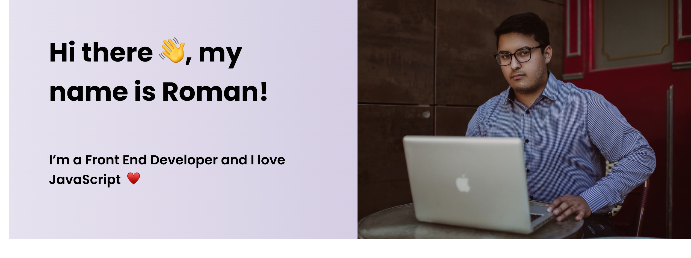

# Welcome, this is my Github!

I love coding, especially in JavaScript. However, I love learning new things constantly, so I never stop trying interesting technologies. I currently focus on frontend development, but I will become a FullStack developer soon, as I like to think that boundaries are set by us, and I have no limits to my capabilities.

Please feel free to give me your comments and recomendations. I really try to improve and I'm willing to share what I know with you. 

- 🌱 I’m currently learning Java☕ 
- 📫 How to reach me: romansantillan1998@outlook.com 
- 👨‍💻 Where to see my projects: <a href="https://sauloromansantillannava.netlify.com/">https://sauloromansantillannava.netlify.com/</a>

My social media 👥👨

 * Instagram. <a href="https://www.instagram.com/sauloromandev/">https://www.instagram.com/sauloromandev/</a>
 * Linkedin. <a href="https://linkedin.com/in/saulo-roman-santillan-nava/">https://linkedin.com/in/saulo-roman-santillan-nava/</a>

 

